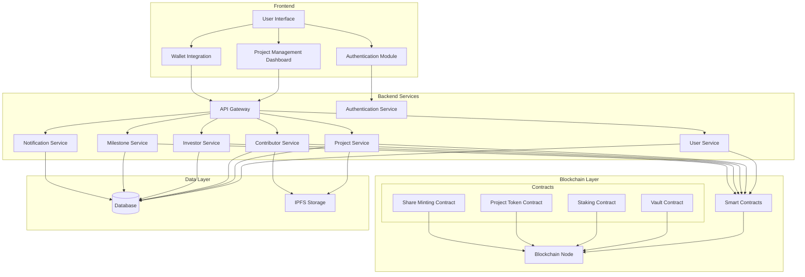

# Imara Platform

## Overview

Imara is a comprehensive blockchain-based platform designed to help ideas get off the ground and ensure their successful implementation through a combination of blockchain technology, community engagement, and structured project management. The platform connects ideators, contributors, and investors in a secure, transparent ecosystem powered by Lisk blockchain technology.

## Key Features

- **Blockchain-powered staking mechanism** for ensuring contributor commitment
- **Smart contract-based milestone tracking** for transparent project management
- **Tokenized incentive structure** for contributors and ideators
- **Decentralized funding mechanism** connecting projects with investors
- **Comprehensive profile system** for verification and reputation building

## User Journeys

### Ideator Journey

1. **Registration & Onboarding**
   - Sign up and complete profile
   - Select "Ideator" role
   - Access idea creation dashboard

2. **Project Creation**
   - Define project details and goals
   - Specify required roles and skills
   - Set staking requirements for contributors
   - Define milestones and timelines
   - Submit project for approval and publication

3. **Project Management**
   - Review contributor applications
   - Approve milestones and deliverables
   - Distribute investor funds among contributors
   - Track overall project progress

### Contributor Journey

1. **Registration & Profile Creation**
   - Sign up and complete profile with required credentials:
     - GitHub profile
     - Previous work links
     - Twitter handle
     - Resume
     - LinkedIn profile

2. **Project Application**
   - Browse available projects
   - Select project of interest
   - Review staking requirements and terms
   - Submit application with proposed milestones and timeline
   - Await approval from project lead

3. **Staking & Contribution**
   - Receive approval notification
   - Stake required Lisk tokens within 72-hour window
   - Receive share tokens representing locked stake
   - Work on assigned milestones
   - Submit proof of milestone completion for review

4. **Rewards & Withdrawal**
   - Upon milestone approval, tokens become available for withdrawal
   - Sign transaction to return share tokens to vault
   - Receive original Lisk tokens back to wallet
   - Option to convert to fiat via offramp provider

### Investor/Donator Journey

1. **Registration & Verification**
   - Sign up and complete profile
   - Connect wallet for Lisk token transactions

2. **Project Funding**
   - Browse projects seeking investment
   - Review project details and contributor profiles
   - Send Lisk tokens to project vault
   - Monitor fund distribution and project progress

## System Architecture

### Core Components

1. **Frontend Layer**
   - User Interface (Web & Mobile)
   - Authentication Module
   - Project Management Dashboard
   - Wallet Integration

2. **Backend Services**
   - API Gateway
   - User Service
   - Project Service
   - Contributor Service
   - Investor Service
   - Milestone Service
   - Notification Service
   - Authentication Service

3. **Blockchain Layer**
   - Smart Contracts:
     - Vault Contract (holds staked tokens)
     - Staking Contract (manages staking/unstaking processes)
     - Project Token Contract (manages project-specific tokens)
     - Share Minting Contract (creates/burns share tokens)
   - Blockchain Node (Lisk network integration)

4. **Data Layer**
   - Database (user profiles, project details, contributions)
   - IPFS Storage (project files, documentation)

## Technical Workflows

### Project Creation Workflow

1. Ideator submits project details through UI
2. Backend validates submission and stores in database
3. Smart contract created for project with unique address
4. Contract address stored in project record
5. Project published to marketplace for contributors to discover

### Contribution Workflow

1. Contributor applies to project with proposed milestones
2. Project lead reviews and approves application
3. Contributor receives 72-hour window to stake tokens
4. Contributor connects wallet and transfers Lisk tokens to vault contract
5. Vault contract mints share tokens and sends to contributor wallet
6. Smart contract records staking details and lock period
7. Contributor works on milestones according to proposed timeline

### Milestone Completion Workflow

1. Contributor submits evidence of milestone completion
2. Project lead reviews submission and approves via transaction
3. Smart contract validates milestone achievement
4. Contributor can claim tokens by sending share tokens back to vault
5. Vault burns share tokens and releases original Lisk tokens
6. Contributor receives tokens in wallet

### Investment Workflow

1. Investor browses projects and selects one to fund
2. Investor sends Lisk tokens to project vault
3. Project lead initiates distribution transaction
4. Smart contract distributes tokens to contributors based on parameters
5. Contributors receive notification of additional funding

## Current Limitations & Future Improvements

1. **Identity Verification**
   - Current reliance on social/professional profiles
   - Future: Implement KYC/AML verification for higher-value projects

2. **Dispute Resolution**
   - Need for robust dispute handling mechanisms
   - Future: Implement multi-signature escrow contracts and decentralized arbitration

3. **Token Liquidity**
   - Contributors face lock periods for staked tokens
   - Future: Implement partial unlocking based on milestone completion percentage

4. **Performance Metrics**
   - Limited visibility into contributor history
   - Future: Create contributor reputation system with historical metrics

5. **Cross-chain Compatibility**
   - Currently limited to Lisk blockchain
   - Future: Implement cross-chain bridges for multi-token support

6. **User Experience**
   - Complex blockchain interactions
   - Future: Abstract complexity through intuitive UI and guided workflows

## Getting Started

*Detailed setup and installation instructions to be added in future updates*

## Contributing

*Contribution guidelines to be added in future updates*

## License

*License information to be added in future updates*